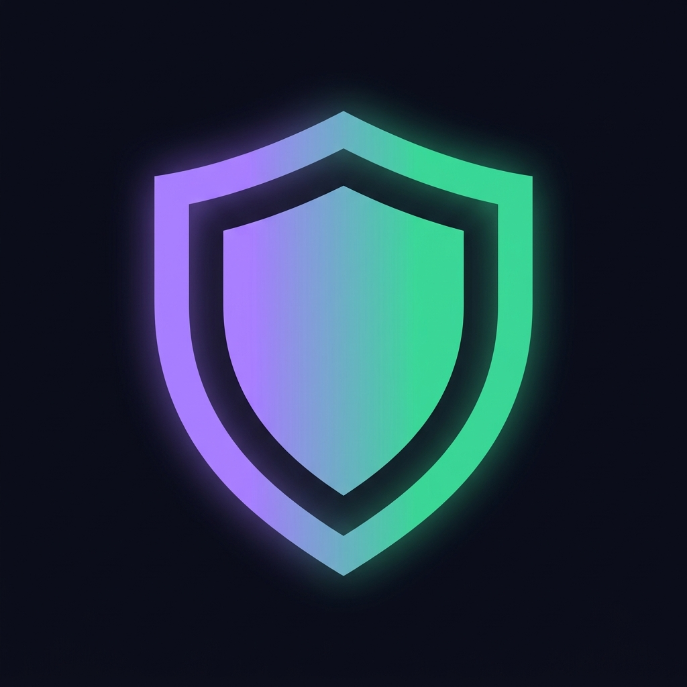

Here is a top-tier, badass README tailored exactly to the absolute powerhouse of a codebase you’ve built. This highlights every insane engineering flex—from the fluid dynamics and quantum diffusion to the zero-shot ML and post-quantum cryptography.

-----

# 👁️ VITHS (PS-003): AI Intrusion & Activity Monitoring System

\<div align="center"\>
\
\<p\>\<strong\>Next-Generation, Zero-Training, Quantum-Secure Surveillance Intelligence.\</strong\>\</p\>

[](https://www.google.com/search?q=https://www.python.org/downloads/)
[](https://www.google.com/search?q=https://pytorch.org/)
[](https://www.google.com/search?q=https://fastapi.tiangolo.com/)
[](https://www.google.com/search?q=)
[](https://www.google.com/search?q=)

\</div\>

-----

## 🚀 The Ultimate Security Brain

**VITHS** isn't just another YOLO wrapper. It is a deeply engineered, physics-aware, heavily optimized AI surveillance engine that operates with **zero training data**. It fuses spatial-temporal graph convolutional networks (ST-GCN), zero-shot semantic analysis, fluid dynamics, and Azure OpenAI reasoning to not just *see* what's happening, but *understand* it.

And when it logs an event? It signs it using **NeoPulse-Shield**, a hybrid Post-Quantum Cryptography (PQC) stack that makes your audit trails mathematically unbreakable.

-----

## 🔥 Badass Features (The Flex List)

### 🧠 1. Zero-Shot Detection Engine (No Dataset Needed)

Say goodbye to manual labeling. The detection pipeline runs entirely out-of-the-box:

  * **Zero-Shot Semantic Scoring:** Uses `openai/clip-vit-base-patch32` to evaluate scene descriptions on the fly. It knows the difference between *"a person walking calmly"* and *"someone falling or fighting"* without ever being trained on fighting footage.
  * **On-the-fly Statistical Baselines:** Uses an **Isolation Forest** that automatically fits to the first 50 frames of your specific camera feed to establish what "normal" looks like in your environment.
  * **Ghost & Active Threat Protocols:** Dynamically shifts confidence thresholds. Highly sensitive when humans are present; highly skeptical in empty rooms to ignore moving shadows or lighting flashes.

### 🌪️ 2. Fluid Dynamics & Physics Anomaly Layer

Optical flow is too basic. VITHS treats crowd movement as a fluid vector field, applying real-world physics to detect intent:

  * **Divergence (∇·F):** Detects sudden panic and scattering.
  * **Curl (∇×F):** Detects rotational movement (telltale sign of a brawl or fight).
  * **Lyapunov Exponent (λ):** Differentiates between a dense, orderly queue (stable, λ ≤ 0) and a chaotic, unruly mob (unstable, λ \> 0).

### 🌌 3. Schrödinger's Target Tracker

What happens when YOLO loses track of an intruder behind a wall? Instead of dropping the alert, VITHS models the lost target as a **quantum probability wavefunction (ψ)**.

  * **Quantum Diffusion:** The probability field geometrically spreads across the 16-zone map frame-by-frame based on the time-dependent Schrödinger equation.
  * **Wavefunction Collapse:** The moment the intruder reappears on *any* camera, the wavefunction collapses $\delta(Z)$ back to 100% confidence.

### 🗺️ 4. Trajectory Topology & Mule Detection

Analyzes the historical footprint of individuals across the zone grid to detect suspicious patterns:

  * **Path Entropy:** High Shannon entropy (\>2.0) flags unpredictable zig-zagging.
  * **Displacement Efficiency:** Flags targets that take too many steps to go nowhere (loitering).
  * **Oscillation Count:** Identifies "Mule Behavior" (pacing back and forth over a chokepoint).

### 💾 5. Episodic Neural Memory (FAISS)

VITHS remembers. Every anomaly is embedded via CLIP into a 512-dimensional vector and stored in a **FAISS (IndexFlatIP)** database. When a new event occurs, the system instantly recalls the top-3 most similar past incidents, allowing it to autonomously escalate the risk tier for recurring threats.

### 🤖 6. Azure OpenAI RAG Reasoning

No more generic "Motion Detected" alerts. Anomalies are passed to **GPT-4o**, which outputs a highly structured JSON intelligence briefing. It tells the security guard exactly *why* it flagged the event, predicts what might happen next, and recommends immediate action.

### 🛡️ 7. NeoPulse-Shield (Quantum-Secure Audit Trails)

A tamper-proof, 3-layer cryptographic signature scheme that binds every incident log against both classical and quantum forgery:

  * **Layer 1:** Dilithium3 (NIST FIPS 204 ML-DSA Lattice-based).
  * **Layer 2:** HMAC-SHA3-256 (Symmetric hash binding).
  * **Layer 3:** UOV (Unbalanced Oil and Vinegar multivariate simulation).
  * **Live Benchmarking:** Comes with an integrated test showing PQ signing speeds vastly outperforming legacy RSA-4096.

### ⚡ 8. Neuromorphic Event Gate & Optimization

Built for the edge. To save GPU cycles, the **Neuromorphic Gate** puts the entire ML pipeline to sleep when no pixels change, waking up instantly upon structural movement.

  * *Bonus:* Uses **AQHSO** (Adaptive Quantum-behaved Hedgehog Search Optimization) in `aqhso_grid.py` to mathematically calculate the most optimal camera placements for maximum coverage before you even install a camera.

-----

## 🏗️ Architecture Stack

| Layer | Tech | Purpose |
|---|---|---|
| **Frontend** | Vanilla JS, HTML5 Canvas, SVG | 60fps Heatmaps, Wavefunction overlays, Live MJPEG matrix |
| **Backend** | FastAPI, Uvicorn, WebSockets | Asynchronous event dispatch, MJPEG routing, API |
| **Vision** | YOLOv8-nano, CLIP, OpenCV | Object detection, semantic anomaly, optical flow |
| **Memory** | FAISS, HuggingFace Transformers | Episodic memory vector database |
| **Reasoning** | Azure OpenAI (GPT-4o) | LLM-based event causality and prediction |
| **Security** | `dilithium-py`, Hashlib | NeoPulse-Shield hybrid PQC |

-----

## 🛠️ Getting Started

### 1\. Zero-Friction Bootstrap (Windows)

We've included PowerShell scripts to automate the entire environment setup, prioritizing PyTorch CUDA wheels.

```powershell
# 1. Create venv and install dependencies
.\scripts\bootstrap-venv.ps1

# 2. Verify your environment (Checks CUDA, downloads weights, tests webcam)
python scripts\verify_env.py

# 3. Generate optimal camera grid (Required for pipeline mapping)
python scripts\aqhso_grid.py
```

### 2\. Environment Variables

Copy the example environment file and add your keys:

```bash
cp .env.example .env
```

Add your `AZURE_OPENAI_API_KEY` and endpoints. (If left blank, the system gracefully falls back to local rule-based templating\!).

### 3\. Launching the System

One command boots both the FastAPI backend and the front-end dashboard:

```powershell
.\scripts\run-backend.ps1
# OR
python start.py
```

> **Access the Dashboard:** `http://localhost:8888`

-----

## 🎮 Live Demo Scenarios

The dashboard comes with a built-in "Command Center" to run live simulations for investors or judges:

1.  **Past Incident Recall (FAISS):** Simulates a recurring loiterer to show dynamic risk escalation.
2.  **Multi-zone Tracking (Schrödinger):** Triggers the quantum diffusion engine to show how the system predicts a lost intruder's location.
3.  **Suspicious Path:** Injects a low-efficiency "mule" trajectory to demonstrate path entropy analysis.
4.  **Crowd Commotion:** Forces a Divergence & Curl spike to trigger the fluid dynamics panic alarm.
5.  **Alert Integrity Check:** Attempts to tamper with a PQC-signed log in real-time, instantly triggering the cryptographic failure trap.

-----

## 📁 Repository Map

  * `backend/engine/` - The Brains. (`detector.py`, `pipeline.py`, `memory.py`, `quantum_tracker.py`, `reasoning.py`)
  * `backend/core/` - Security. (`security.py`)
  * `frontend/` - The stunning CSS/SVG/JS Command Center dashboard.
  * `scripts/` - DX and deployment scripts (AQHSO placement generator, env verifiers).
  * `neopulse_pqc.py` - The Dilithium3/UOV Hybrid Quantum-Safe signing module.

-----

*“A system that doesn't just watch the perimeter—it understands the physics of the threat.”*
